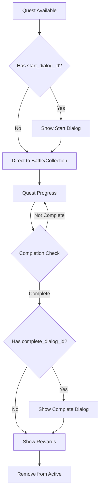

# Hero Fate – Web Game Online (Dự án học lập trình)

## 1. Giới thiệu chung

**Hero Fate** là một web game online đơn giản, được thiết kế như một dự án học tập để học viên mới bắt đầu học lập trình có thể thực hành theo. Game có lối chơi nhẹ nhàng, gồm hai phần chính: **xây dựng thị trấn** và **chiến đấu theo lượt (turn-based)**.

**🎮 Enhanced Navigation Bar:**
- **User Stats**: Cấp độ, Vàng, EXP, Danh tiếng với icons  
- **Player Info Button**: Nút "Thông tin" mở modal chi tiết về player
- **Navigation Actions**: Thị trấn, Nhiệm vụ, Kho đồ, Đăng xuất
- **Clean Layout**: Streamlined horizontal bar without avatar clutter

**📋 Player Info Modal (NEW):**
- **Trigger**: Click nút "Thông tin" trong navigation bar
- **Layout**: Modal nằm ngang với 2 cột chính
  - **Left Side**: Player avatar (128x128 canvas) + username
  - **Right Side**: Stats grid với 10 thông số (Level, Gold, EXP, Reputation, STR, AGI, INT, VIT, WIS, Crit Rate)
- **Animation**: Configurable idle animation chỉ chạy khi modal mở
- **Auto-close**: Animation tự động dừng khi đóng modal
- **Professional**: Centered layout với proper spacing

**� Player Animation System (ENHANCED):**
- **GML.js Integration**: Sử dụng thư viện tự tạo cho sprite animation
- **Canvas Rendering**: 128x128 canvas với idle animation full-size
- **Configurable Speed**: Animation speed có thể điều chỉnh qua JavaScript
- **Control Functions**:
  - `setAnimationSpeed(speed)`: Điều chỉnh tốc độ (0.05-0.3)
  - `setAnimationPreset(preset)`: Sử dụng preset ('slow', 'normal', 'fast')
  - `getAnimationSpeed()`: Lấy tốc độ hiện tại
  - `startPlayerAnimation()` / `stopPlayerAnimation()`: Control animation
- **On-demand**: Animation chỉ chạy khi Player Info Modal mở
- **Performance**: Efficient memory usage với conditional rendering thể thực hành theo. Game có lối chơi nhẹ nhàng, gồm hai phần chính: **xây dựng thị trấn** và **chiến đấu theo lượt (turn-based)**.
- Khi thiếu nhiệm vụ, hệ thống tự thêm mới từ file JSON
- Nút "Bắt đầu" sẽ chuyển sang `/battle` (thay vì navigation trực tiếp)

### D. Chiến đấu theo lượt (`/battle`) - Protected Route

- Dạng 1 vs 1, luân phiên
- Kẻ địch xác định qua `battle_enemy` (từ localStorage)  
- Gọi API lấy dữ liệu enemy từ JSON
- **Chỉ truy cập từ quests**: Không có direct navigation button

### E. Hội thoại (`/dialog/<id>/<quest_id>`) - Protected Routeation Bar:**
- **Player Avatar**: Canvas animation với male_idle.png (4 frames, 128x128 → 64x64)
- **User Stats**: Cấp độ, Vàng, EXP, Danh tiếng với icons
- **Navigation Actions**: Thị trấn, Nhiệm vụ, Kho đồ, Đăng xuất
- **Integrated Layout**: Single horizontal bar thay vì multiple sections

**🏗️ Buildings Grid:**
- Các công trình được render dạng card theo grid 3 cột
- Hover để xem tên, click mở modal tương ứng
- Tòa thị chính mở `/quests`
- Có nút "Xây dựng" để hiện danh sách công trình có thể xây

**🎨 Player Animation System:**
- **GML.js Integration**: Sử dụng thư viện tự tạo cho sprite animation
- **Canvas Rendering**: 64x64 canvas với idle animation
- **Frame Management**: 4 frames với tốc độ 0.2, loop tự động
- **Fallback**: Icon 👤 nếu không load được spriteới bắt đầu học lập trình có thể thực hành theo. Game có lối chơi nhẹ nhàng, gồm hai phần chính: **xây dựng thị trấn** và **chiến đấu theo lượt (turn-based)**.

Dự án sử dụng công nghệ phổ biến, đơn giản, dễ học và dễ triển khai.

---

## 2. Mục tiêu dự án

- Giúp học viên hiểu được luồng hoạt động của một ứng dụng web fullstack.
- Thực hành sử dụng API, kết nối frontend – backend – database.
- Làm quen với các công nghệ cơ bản: Flask, MongoDB, HTML/CSS, JavaScript (XHR).
- Phát triển kỹ năng tư duy logic, làm việc với dữ liệu JSON, xử lý client-side storage (localStorage).

---

## 3. Công nghệ sử dụng

### Backend

- Python
- Flask (REST API) + Flask-Login (Authentication)
- MongoDB (NoSQL database): chỉ sử dụng cho dữ liệu **user**
  - **Development**: MongoDB Local (nhanh hơn, khuyến nghị)
  - **Production**: MongoDB Atlas (cloud)
- Session-based authentication với Flask-Login
- Các dữ liệu hệ thống khác như **quái vật (enemies), vật phẩm (items), nhiệm vụ (quests), hội thoại (dialogs), công trình (buildings), kỹ năng (skills)** sẽ được lưu trữ trong các file JSON tĩnh trên server, để giúp học viên dễ đọc, dễ chỉnh sửa, dễ hiểu.

#### Cấu trúc database `users`

```json
{
  "username": "cuongnv",
  "password": "123456",
  "created_at": "...",
  "gender": "male",
  "buildings": {
    "town_hall": 1,
    "storage": 1,       // Đã đổi từ "inventory"
    "blacksmith": 0,    // Đã đổi từ "forge"
    "market": 0,        // Đã đổi từ "shop"
    "mage_tower": 0
  },
  "quests": [
    { "quest_id": "q001", "state": "doing" },
    { "quest_id": "q004", "state": "done" }
  ],
  "dialogs_seen": [12],
  "inventory": [
    { "item_id": "sword001", "quantity": 1, "level": 2 },
    { "item_id": "hp_potion", "quantity": 5 }
  ],
  "gold": 1250,
  "exp": 780,
  "reputation": 35,
  "stats": {
    "STR": 12,
    "AGI": 8,
    "INT": 5,
    "VIT": 10,
    "WIS": 7,
    "crit_rate": 0.1
  },
  "skills": [
    { "skill_id": 1, "level": 2 },
    { "skill_id": 3, "level": 1 }
  ]
}
```

- `username`, `password`: thông tin đăng nhập
- `gender`: giới tính người chơi (`male` hoặc `female`) — được sử dụng để chọn hình ảnh nhân vật từ thư mục `static/img/player/`
- `buildings`: lưu cấp độ các công trình đã xây (0 nghĩa là chưa xây)
- `quests`: danh sách các nhiệm vụ người chơi đã nhận (và trạng thái)
- `dialogs_seen`: lưu lại những đoạn hội thoại đã xem
- `inventory`: chứa các item người chơi sở hữu
- `gold`: số tiền hiện có
- `exp`: kinh nghiệm hiện tại (level được tính từ EXP này)
- `reputation`: danh tiếng, ảnh hưởng đến tương tác NPC
- `stats`: chỉ số RPG
- `skills`: kỹ năng đã học và cấp độ tương ứng

### Frontend

- HTML, W3.CSS, CSS tùy chỉnh với background images
- Font Awesome 5.15.4
- JavaScript (dùng Fetch API để gọi API)
- **GML.js**: Thư viện sprite animation tự phát triển
- **Support.js**: Utilities và helper functions
- Responsive design với mobile support
- Visual effects và animations

---

## 4. Frontend Libraries & Animation System

### 4.1. GML.js - Game Maker Language JavaScript
**GML.js** là thư viện sprite animation tự phát triển, lấy cảm hứng từ GameMaker Studio:

```javascript
// Tạo sprite với 4 frames animation
const playerSprite = spriteCreate(
    '/static/img/player/male_idle.png', 
    128,    // sprite width
    128,    // sprite height  
    4,      // number of frames
    64,     // origin x
    64      // origin y
);

// Tạo instance của sprite
const playerInstance = instCreate(x, y, 0, playerSprite);
playerInstance.imageSpeed = 0.15;  // Animation speed
playerInstance.imageLoop = true;   // Loop animation
```

**Tính năng chính:**
- **Sprite Management**: Load và quản lý sprite sheets
- **Frame Animation**: Hỗ trợ multi-frame animation với tốc độ có thể điều chỉnh
- **Instance System**: Tạo và quản lý multiple instances của cùng một sprite
- **Canvas Rendering**: Render sprites lên HTML5 Canvas
- **Performance Optimized**: Chỉ render khi cần thiết

### 4.2. Support.js - Utility Functions
**Support.js** chứa các helper functions và utilities:

```javascript
// Toast notification system
showToast(message, type);  // 'success', 'error', 'warning', 'info'

// API call wrapper với error handling
apiCall(endpoint, options);

// User data management
getUserData();
updateUserInfoDisplay(userData);

// Level calculation từ EXP
calculateLevel(exp);

// Modal management
closeModal();
```

**Chức năng chính:**
- **Toast System**: Thông báo user-friendly
- **API Wrapper**: Xử lý HTTP requests với error handling
- **Data Management**: LocalStorage và session management  
- **UI Utilities**: Modal controls, form validation
- **Game Logic**: Level calculation, stat management

### 4.3. Player Animation Integration
```javascript
// Animation control functions
setAnimationSpeed(speed);        // 0.05 - 0.3
setAnimationPreset(preset);      // 'slow', 'normal', 'fast'
getAnimationSpeed();             // Get current speed
startPlayerAnimation();          // Start animation
stopPlayerAnimation();           // Stop animation

// Configuration object
const ANIMATION_CONFIG = {
    FRAME_SPEED: 0.1,
    FRAME_COUNT: 4,
    CANVAS_SIZE: 128,
    SPRITE_SIZE: 128,
    AUTO_START: false
};
```

---

## 5. Modal System & UI Standards

### 5.1. Modal Structure Standards
Tất cả modals trong game tuân theo cấu trúc 3 phần chuẩn:

```html
<div id="modalName" class="modal">
    <div class="modal-content">
        <!-- Modal Header -->
        <div class="modal-header">
            <h2 class="modal-title">
                <i class="fas fa-icon"></i> Tiêu đề Modal
            </h2>
            <button class="modal-close" onclick="closeModal()">
                <i class="fas fa-times"></i>
            </button>
        </div>
        
        <!-- Modal Body -->
        <div class="modal-body">
            <!-- Nội dung chính của modal -->
        </div>
        
        <!-- Modal Footer -->
        <div class="modal-footer">
            <button class="btn btn-primary">Hành động chính</button>
            <button class="btn btn-secondary" onclick="closeModal()">Đóng</button>
        </div>
    </div>
</div>
```

### 5.2. Modal Sizing Standards
```css
/* Standard modal */
.modal-content {
    max-width: 700px;
    width: 85%;
}

/* Large modal (cho inventory, player info) */
.inventory-modal .modal-content {
    max-width: 900px;
    width: 95%;
}

/* Player info modal */
.player-info-modal {
    max-width: 750px;
    width: 90%;
}
```

### 5.3. Button Consistency
```css
/* Modal footer buttons luôn được căn giữa và có khoảng cách đều */
.modal-footer {
    display: flex;
    justify-content: center;
    gap: var(--spacing-md);
}

/* Button styling standards */
.btn-primary {
    background: var(--primary-color);
}

.btn-secondary {
    background: var(--primary-color-light);
}
```

---

## 6. Inventory System

### 6.1. Inventory Layout (70% - 30%)
Hệ thống inventory sử dụng layout chia đôi hiện đại:

```
┌─────────────────────────────────────────────────────────┐
│                    INVENTORY MODAL                      │
├─────────────────────┬───────────────────────────────────┤
│   GRID SLOTS (65%)  │      ITEM DETAIL (35%)           │
│                     │                                   │
│ [Tab Buttons]       │  ┌─────────────────────────────┐   │
│                     │  │       Item Image            │   │
│ ┌─┬─┬─┬─┬─┬─┐       │  │    (Animated Pulse)         │   │
│ │ │ │ │ │ │ │       │  └─────────────────────────────┘   │
│ ├─┼─┼─┼─┼─┼─┤       │                                   │
│ │ │ │ │ │ │ │       │  Item Name                       │
│ ├─┼─┼─┼─┼─┼─┤       │  Item Type (Việt hóa)            │
│ │ │ │ │ │ │ │       │  Price: 100 vàng                 │
│ ├─┼─┼─┼─┼─┼─┤       │  Level Requirement               │
│ │ │ │ │ │ │ │       │                                   │
│ ├─┼─┼─┼─┼─┼─┤       │  Description text...              │
│ │ │ │ │ │ │ │       │                                   │
│ └─┴─┴─┴─┴─┴─┘       │  ┌─────────────────────────────┐   │
│                     │  │        STATS                │   │
│                     │  │  STR: +10                   │   │
│                     │  │  AGI: +5                    │   │
│                     │  └─────────────────────────────┘   │
└─────────────────────┴───────────────────────────────────┘
```

### 6.2. Grid System (6x6 Slots)
```javascript
// 36 slots total (6 columns x 6 rows)
.inventory-grid {
    display: grid;
    grid-template-columns: repeat(6, 1fr);
    row-gap: 6px;
    column-gap: 6px;
}

// Slot states
.inventory-slot {
    aspect-ratio: 1;
    border: 2px solid var(--border-color);
}

.inventory-slot:hover {
    border-color: var(--primary-color);  // Blue hover
}

.inventory-slot.selected {
    border-color: #e74c3c;  // Red selection
}

.inventory-slot.empty {
    background: rgba(127, 140, 141, 0.1);  // Gray empty
}
```

### 6.3. Item Display & Icons
```javascript
// Item icons từ static/img/icon/item/{item_id}.webp
function getItemIcon(itemData) {
    return `/static/img/icon/item/${itemData.item_id}.webp`;
}

// Fallback system nếu image không load

<i class="item-icon fallback fas fa-cube" style="display: none;"></i>
```

### 6.4. Tooltip System
**Hover Tooltip**: Khi hover qua slot item
```javascript
// Show tooltip on hover
onmouseenter="showItemTooltip('${item.item_id}')"
onmouseleave="hideItemTooltip()"

// Click to select
onclick="selectItem('${item.item_id}')"
```

**Item Detail Panel**: Hiển thị chi tiết bên phải
- **Animated Image**: 90x90px với pulse animation  
- **Item Information**: Name, type (Việt hóa), price, description
- **Stats Display**: Equipment stats nếu có
- **Level Requirement**: Hiển thị yêu cầu level nếu có

### 6.5. Item Types & Behavior
```javascript
// Type mapping sang tiếng Việt
const typeMap = {
    'material': 'Nguyên liệu',
    'equipment': 'Trang bị',
    'consumable': 'Vật phẩm tiêu hao',
    'weapon': 'Vũ khí',
    'armor': 'Giáp',
    'accessory': 'Phụ kiện'
};

// Equipment actions
if (selectedItem && currentTab === 'equipment') {
    // Show "Sử dụng" button in modal footer
    useButton.style.display = 'inline-flex';
}
```

### 6.6. Inventory Data Structure
```javascript
// User inventory format
"inventory": [
    {
        "item_id": "bronze_sword",
        "quantity": 1,
        "level": 2  // Chỉ cho equipment
    },
    {
        "item_id": "wood", 
        "quantity": 50  // Materials có thể stack
    }
]

// Item data from items.json
{
    "item_id": "bronze_sword",
    "name": "Gươm đồng", 
    "type": "equipment",
    "price": 120,
    "description": "Một thanh gươm đơn giản làm từ đồng",
    "level_require": 1,
    "stat": {
        "STR": 3
    }
}
```

---

## 7. Authentication & Session Management

### 7.1. Flask-Login Integration
- **Session-based authentication**: Sử dụng Flask-Login để quản lý session
- **Protected routes**: Các trang như `/town`, `/quests` yêu cầu đăng nhập
- **Automatic redirects**: 
  - Chưa đăng nhập → redirect đến `/` (trang login)
  - Đã đăng nhập → redirect từ `/` đến `/town`

### 7.2. User Model
```python
class User(UserMixin):
    def __init__(self, user_data):
        self.id = user_data.get('username')
        self.username = user_data.get('username')
        # ... other user properties
    
    def get_id(self):
        return self.username
```

### 7.3. API Endpoints
- `POST /api/register` - Đăng ký tài khoản mới
- `POST /api/login` - Đăng nhập (tạo session)
- `POST /api/logout` - Đăng xuất (xóa session)
- `GET /api/auth-status` - Kiểm tra trạng thái đăng nhập
- `GET /api/user` - Lấy thông tin user hiện tại (protected)

---

## 8. UI/UX Improvements

### 8.1. Visual Design
- **Header**: Background image từ `static/img/background/1.jpg`
- **Building System**: 
  - Hình ảnh building từ `static/img/building/{building_id}.png`
  - Ground texture: `static/img/building/ground.png`
  - Building images được scale 2x để nổi bật
- **Visual States**: 
  - Đã xây: Màu bình thường + level badge xanh
  - Chưa xây: Grayscale filter + level badge đỏ

### 8.2. Desktop-Only Experience
- **Platform Support**: Chỉ hỗ trợ máy tính để bàn và laptop
- **Screen Requirements**: Độ phân giải tối thiểu 1024x768
- **Mobile Detection**: Tự động redirect thiết bị mobile đến `/not-implemented`
- **Optimized Layout**: 3 cột buildings được tối ưu cho màn hình lớn

### 8.3. Mobile Not Supported
- **Auto Detection**: JavaScript kiểm tra User Agent và screen size
- **Redirect Logic**: Mobile users → `/not-implemented` page
- **Clear Messaging**: Thông báo rõ ràng về yêu cầu hệ thống
- **No Responsive CSS**: Đã loại bỏ toàn bộ mobile responsive để tối ưu performance

---

## 9. Quest & Dialog System (Enhanced)

### 9.1. Quest Management System

**🎯 Core Quest Features:**
- **Active Quest Limit**: Tối đa 5 quest active đồng thời
- **Auto Quest Assignment**: Tự động assign quest mới khi có slot trống
- **Level-based Filtering**: Quest chỉ xuất hiện khi đủ level requirement
- **State Management**: Available → Doing → Completed lifecycle

**📋 Quest Interface Design:**
- **Grid Layout**: Quest cards hiển thị dạng grid responsive
- **Quest Preview**: Name, description, level requirement, rewards
- **Action States**: 
  - "Bắt đầu" → Available quests
  - "Hoàn thành" → Quests với completed conditions
  - "Đang thực hiện" → Active quests in progress

**🔄 Quest Execution Flow:**


### 9.2. Dialog System Architecture

**💬 Advanced Dialog Features:**
- **Dynamic Backgrounds**: Priority system cho background selection
- **Progressive Blur**: Background blur effect với smooth transition
- **Sequential Messaging**: Messages hiển thị tuần tự với animations
- **Speaker Integration**: Avatar + localized names cho NPCs

**🎭 Dialog Interface Components:**

```html
<!-- Dialog Structure -->
<div class="dialog-container">
    <div class="dialog-background" style="background-image: url(...)"></div>
    <div class="dialog-wrapper">
        <div class="dialog-header">
            <h3>Quest Name</h3>
            <p class="dialog-type">Bắt đầu/Hoàn thành nhiệm vụ</p>
        </div>
        <div class="dialog-content">
            <div class="dialog-messages">
                <div class="dialog-message">
                    <div class="message-speaker">
                        
                        <span class="speaker-name">Speaker Name</span>
                    </div>
                    <div class="message-text">Dialog text...</div>
                </div>
            </div>
            <div class="dialog-controls">
                <button class="btn btn-primary">Tiếp tục</button>
            </div>
        </div>
    </div>
</div>
```

**🎨 Visual Enhancement System:**
```css
/* Background blur chỉ áp dụng cho background */
.dialog-background {
    filter: blur(2px);
    transition: filter 0.3s ease;
}

.dialog-background.focused {
    filter: blur(1px);
}

/* Message animation */
.dialog-message {
    opacity: 0;
    transform: translateY(20px);
    transition: all 0.3s ease;
}

.dialog-message.active {
    opacity: 1;
    transform: translateY(0);
}
```

### 9.3. Background Asset Management

**🖼️ Rich Background Collection:**
- **16 Different Backgrounds**: village, forest, cave, harbor, market, etc.
- **Context-Aware Mapping**: Background phù hợp với dialog content
- **Priority System**: `dialogData.background` → `quest.background` → fallback

**📂 Background Categories:**
```javascript
const backgroundCategories = {
    'Urban': ['village.jpg', 'market.jpg', 'room.jpg'],
    'Nature': ['forest.jpg', 'meadow.jpg', 'grassland.jpg'], 
    'Underground': ['cave.jpg', 'mine.jpg', 'lavacave.jpg'],
    'Coastal': ['harbor.jpg'],
    'Mysterious': ['ruins.png', 'desert.jpg'],
    'Specialized': ['snowfield.jpg', '1.jpg', '2.jpg', '3.jpg']
};
```

### 9.4. Speaker & Character System

**🎪 Comprehensive Speaker Database:**
```javascript
const speakerDatabase = {
    // NPCs
    'elder': { name: 'Trưởng làng', avatar: 'elder.png' },
    'merchant': { name: 'Thương gia', avatar: 'merchant.png' },
    'guard': { name: 'Lính canh', avatar: 'guard.png' },
    'john-fisher': { name: 'John - Ngư dân', avatar: 'john-fisher.png' },
    'marcus-scholar': { name: 'Marcus - Học giả', avatar: 'marcus-scholar.png' },
    'mina-inn-keeper': { name: 'Mina - Chủ quán trọ', avatar: 'mina-inn-keeper.png' },
    'jack-sailor': { name: 'Jack - Thủy thủ', avatar: 'jack-sailor.png' },
    'arch-mage': { name: 'Đại pháp sư', avatar: 'arch-mage.png' },
    'duke': { name: 'Công tước', avatar: 'duke.png' },
    'kyrina-pirate-leader': { name: 'Kyrina - Thủ lĩnh cướp biển', avatar: 'kyrina-pirate-leader.png' },
    'mira-dancer': { name: 'Mira - Vũ công', avatar: 'mira-dancer.png' },
    'amon-strange-merchant': { name: 'Amon - Thương gia bí ẩn', avatar: 'amon-strange-merchant.png' },
    
    // Player
    'player': { name: 'Người chơi', avatar: 'player.png' }
};
```

### 9.5. Quest-Dialog Integration

**🔗 Seamless Integration Features:**
- **Dialog Triggering**: Auto-trigger dialog dựa trên quest state
- **Context Passing**: Quest data được pass vào dialog system
- **State Synchronization**: Dialog completion updates quest state
- **Reward Processing**: Integrated reward system sau dialog completion

**⚡ Enhanced User Experience:**
- **Consistent Navigation**: Header + nav bar trong mọi trang
- **Smooth Transitions**: Animation giữa dialog messages
- **User Info Integration**: Real-time display user stats
- **Error Handling**: Graceful fallbacks cho missing data

---

## 10. Các Route

### A. Trang chính (`/`)

- **Logic redirect thông minh:**
  - Chưa đăng nhập: Hiển thị form login/register
  - Đã đăng nhập: Tự động redirect đến `/town`
- **Slideshow**: Giới thiệu game với hình ảnh động
- **Responsive layout**: 2 cột (slideshow + auth forms)

### B. Xây dựng thị trấn (`/town`) - Protected Route

| Công trình                   | Tính năng                                        | Cải tiến nâng cấp                                     |
|-----------------------------|--------------------------------------------------|-------------------------------------------------------|
| Thợ rèn (blacksmith)        | Chế tạo và nâng cấp trang bị                     | Tăng giới hạn upgrade level                           |
| Chợ (market)                | Mua bán vật phẩm                                 | Tăng số lượng item xuất hiện trong shop               |
| Tòa thị chính (town_hall)   | Nhận nhiệm vụ phụ tuyến                          | Tăng độ khó nhiệm vụ                                  |
| Kho (storage)               | Quản lý item người chơi                          | Tăng số lượng slot lưu trữ                            |
| Tháp phép thuật (mage_tower)| Học và nâng cấp kỹ năng phép thuật               | Mở bán sách phép, xem và nâng cấp kỹ năng đã học     |

#### Giao diện `/town`

- Các công trình được render dạng card theo grid 3 cột
- Hover để xem tên, click mở modal tương ứng
- Tòa thị chính mở `/quests`
- Có nút “Xây dựng” để hiện danh sách công trình có thể xây

---

### B. Chiến đấu theo lượt (`/battle`)

- Dạng 1 vs 1, luân phiên
- Kẻ địch xác định qua `battle_enemy` (từ localStorage)
- Gọi API lấy dữ liệu enemy từ JSON

---

### D. Nhiệm vụ (`/quests`) - Protected Route

- Tối đa 5 nhiệm vụ đang hoạt động
- Trạng thái: chưa nhận, đang thực hiện, đã hoàn thành
- Khi thiếu nhiệm vụ, hệ thống tự thêm mới từ file JSON
- Nút “Bắt đầu” sẽ chuyển sang minigame hoặc battle

---

### E. Hội thoại (`/dialog/<id>/<quest_id>`) - Protected Route

- Hiện đoạn thoại tương tác (từng dòng)
- Có 2 loại:
  - Dẫn nhập nhiệm vụ
  - Kết thúc nhiệm vụ, nhận thưởng
- Nội dung lấy từ file `dialogs.json` dựa theo `dialog_id`
- Mỗi dòng có nút **"Tiếp tục"** để chuyển sang dòng kế
- Sau khi kết thúc hội thoại sẽ ảnh hưởng đến nhiệm vụ với `quest_id` tương ứng:
  - Nếu là hội thoại bắt đầu nhiệm vụ → đánh dấu nhiệm vụ là `doing`
  - Nếu là hội thoại kết thúc nhiệm vụ → mở modal phần thưởng, xoá nhiệm vụ khỏi database của user, sau đó redirect về `/town`


---

## 10. Gameplay chính

### 10.1. Cấu trúc file `enemies.json`

(Thư mục ảnh: `static/img/enemies/{enemy_id}_attack_{frame}.png`)

```json
{
  "id": 1023,
  "name": "Troll Rừng",
  "stats": {
    "STR": 15,
    "AGI": 6,
    "INT": 3,
    "VIT": 12,
    "WIS": 5,
    "crit_rate": 0.05
  },
  "skills": [
    { "skill_id": 1001, "priority": 0.7 },
    { "skill_id": 1004, "priority": 0.3 }
  ],
  "drop": [
    { "item_id": 1005, "rate": 0.5 },
    { "item_id": 1006, "rate": 0.2 }
  ],
  "exp_reward": 120
}
```

### Ghi chú:

- `id`: định danh duy nhất của quái, cũng dùng để lấy ảnh hoạt ảnh (`{id}_attack_{frame}.png`)
- `name`: tên hiển thị
- `stats`: chỉ số cơ bản (HP và MP sẽ được tính từ VIT và WIS)
- `skills`: danh sách kỹ năng mà quái sử dụng, kèm `priority` (tỉ lệ ưu tiên dùng skill, tổng cộng không nhất thiết là 1.0)
- `drop`: danh sách item có thể rơi, với `item_id` và `rate` (0.0 → 1.0)
- `exp_reward`: số EXP người chơi nhận được nếu tiêu diệt

---

### 10.2. Cấu trúc file `skills.json`

(Thư mục ảnh: `static/img/icon/skill/{skill_id}.png`)

```json
{
  "skill_id": 1001,
  "name": "Tấn công thường",
  "damage_type": "physical",
  "effect_id": 1
}
```

### Ghi chú:

- `skill_id`: bắt đầu từ 1001, quy ước 1001 là đòn đánh thường
- `name`: tên hiển thị
- `damage_type`: kiểu sát thương (`physical` hoặc `magical`) để quyết định công thức tính damage
- `effect_id`: id của hiệu ứng hiển thị trong trận chiến (ví dụ: hiệu ứng chém, bắn lửa...)
- Không có hình ảnh riêng — icon kỹ năng mặc định là `{skill_id}.png` trong thư mục `skill/`
- Công thức tính damage sẽ được viết riêng trên server tùy theo từng skill

---

### 10.3. Cấu trúc file `items.json`

(Thư mục ảnh: `static/img/icon/item/{item_id}.png`)

```json
{
  "item_id": 1001,
  "name": "Gươm đồng",
  "type": "equipment",
  "price": 120,
  "description": "Một thanh gươm đơn giản làm từ đồng",
  "stat": {
    "STR": 3
  },
  "upgrade_material": [1026, 1030, 1041]
}
```

### Ghi chú:

- `item_id`: số nguyên, bắt đầu từ 1001
- `name`: tên item
- `type`: `equipment` hoặc `material`
- `price`: giá **bán ra**; giá mua được tính là `price + 15%`
- `description`: chú thích ngắn gọn
- `stat`: chỉ có ở item dạng `equipment`, là chỉ số cộng thêm
- `upgrade_material`: danh sách `item_id` dùng để nâng cấp (áp dụng cho equipment)

### Hệ thống inventory:

- Chia làm 2 tab: `equipment` và `material`
- Equipment:
  - Không stack
  - Có chỉ số, có thể nâng cấp
- Material:
  - Stack không giới hạn
  - Dùng để xây dựng, nâng cấp, hoặc làm nhiệm vụ
- Game **không có** item hồi phục hay tiêu dùng → hồi phục sẽ được đảm nhiệm bởi **kỹ năng phép thuật**

---

### 10.4. Cấu trúc file `buildings.json`

(Thư mục ảnh: `static/img/icon/building/{building_id}.png` hoặc `static/img/building/{building_id}.png`)

```json
{
  "building_id": 1001,
  "name": "Tòa thị chính",
  "description": "Nơi nhận nhiệm vụ và điều hành thị trấn.",
  "upgrade_material": {
    "1": {
      "gold": 100,
      "materials": [
        { "item_id": 2001, "quantity": 3 },
        { "item_id": 2002, "quantity": 1 }
      ]
    },
    "2": {
      "gold": 250,
      "materials": [
        { "item_id": 2001, "quantity": 5 },
        { "item_id": 2003, "quantity": 2 }
      ]
    }
  }
}
```

### Ghi chú:

- `building_id`: bắt đầu từ 1001, cũng là tên ảnh đại diện
- `name`: tên công trình
- `description`: mô tả công dụng của công trình
- `upgrade_material`: các nguyên liệu và số vàng cần để xây/lên cấp
  - Key `"1"`, `"2"` là cấp độ (string hoặc số nguyên)
  - `gold`: số vàng cần để nâng cấp
  - `materials`: danh sách nguyên liệu yêu cầu (item_id và quantity)
- **Không có thời gian xây dựng** để đơn giản hóa gameplay


---

### 10.5. Cấu trúc file `quests.json`

(Trang hiển thị: `/quests` – danh sách các nhiệm vụ đang hoạt động hoặc có thể nhận)

```json
{
  "quest_id": "q001",
  "name": "Giải cứu dân làng",
  "description": "Một nhóm quái vật đang đe dọa ngôi làng gần thị trấn. Hãy đánh bại chúng!",
  "background": "forest.jpg",
  "enemy_id": 1023,
  "start_dialog_id": 12,
  "complete_dialog_id": -1,
  "required_items": [],
  "reward": {
    "gold": 300,
    "exp": 150,
    "items": [
        {"item_id": 1031, "quantity": 1 },
        {"item_id": 1025, "quantity": 2 }
    ]
  },
  "level_required": 1
}
```

### Ghi chú:

- `quest_id`: chuỗi định danh nhiệm vụ (dạng `"q001"`)
- `name`: tên nhiệm vụ
- `description`: nội dung mô tả nhiệm vụ, hiển thị ở `/quests`
- `background`: tên file ảnh nền cho trận chiến hoặc dialog (trong `static/img/background/`)
- `enemy_id`: id kẻ địch cần tiêu diệt nếu là nhiệm vụ dạng chiến đấu
- `start_dialog_id`: id hội thoại khởi đầu nhiệm vụ. Nếu là -1 thì không có hội thoại dẫn truyện
- `complete_dialog_id`: id hội thoại khi hoàn thành nhiệm vụ. Nếu là -1 thì không có hội thoại kết thúc
- `required_items`: (tuỳ chọn) danh sách item cần giao nộp để hoàn thành nhiệm vụ
- `reward`: phần thưởng khi hoàn thành nhiệm vụ (gold, exp, items)
- `level_required`: cấp độ tối thiểu để hiển thị nhiệm vụ

### Quest System Features:

**🎯 Quest Assignment Logic:**
- **Auto-generation**: Tự động thêm quest mới khi user có slot trống (tối đa 5)
- **Level filtering**: Chỉ assign quest phù hợp với level của player
- **Random selection**: Chọn ngẫu nhiên từ pool quest available
- **State management**: Track quest states (available → doing → completed)

**🔄 Quest Execution Flow:**
1. **Start Quest**: Click "Bắt đầu" → Check `start_dialog_id`
   - Có dialog → Redirect `/dialog/{start_dialog_id}/{quest_id}`
   - Không dialog → Direct to battle/collection
2. **Quest Progress**: Battle enemies hoặc collect required items
3. **Complete Quest**: Check completion conditions → Show `complete_dialog_id`
4. **Rewards**: Process rewards → Update user stats → Remove from active quests

**⚡ Enhanced Quest Types:**
- **Combat Quest**: Có `enemy_id` → Battle system
- **Collection Quest**: Có `required_items` → Item gathering
- **Story Quest**: Có dialog IDs → Rich narrative experience
- **Hybrid Quest**: Kết hợp combat + collection + story

---
### 10.6. Cấu trúc file `dialogs.json`

(Trang hiển thị: `/dialog/<dialog_id>/<quest_id>` — hiện đoạn hội thoại tương tác)

```json
{
  "dialog_id": 12,
  "type": "start",
  "background": "village.jpg",
  "lines": [
    { "speaker": "elder", "text": "Có phải bạn là một hiệp sĩ?" },
    { "speaker": "elder", "text": "Hiệp sĩ mau giúp đỡ chúng tôi!" },
    { "speaker": "player", "text": "Tôi sẽ giúp ngôi làng này. Nhưng có chuyện gì vậy" },
    { "speaker": "elder", "text": "Có quái vật xuất hiện ở làng phía đông!" },
    { "speaker": "player", "text": "Tôi sẽ đến đó ngay lập tức!" }
  ]
}
```

### Ghi chú:

- `dialog_id`: số nguyên định danh đoạn hội thoại, liên kết với nhiệm vụ
- `type`: `"start"` hoặc `"end"` — phân biệt hội thoại mở đầu hay kết thúc nhiệm vụ
- `background`: tên file ảnh nền hiển thị trong hội thoại (từ `static/img/background/`)
- `lines`: mảng các dòng hội thoại với speaker và text

### Dialog System Features:

**🎭 Advanced Dialog Interface:**
- **Dynamic Background**: Ưu tiên `dialogData.background` → `quest.background` → fallback
- **Background Blur**: Blur effect chỉ áp dụng cho background, không ảnh hưởng UI
- **Sequential Display**: Messages hiển thị tuần tự với smooth animations
- **Speaker Integration**: Avatar + localized name cho mỗi speaker

**🎨 Visual & Animation System:**
```javascript
// Background selection priority
let backgroundUrl = '/static/img/background/village.jpg'; // Default
if (dialogData.background) {
    backgroundUrl = `/static/img/background/${dialogData.background}`;
} else if (quest.background) {
    backgroundUrl = `/static/img/background/${quest.background}`;
}
```

**🔄 Dialog Execution Flow:**
1. **Load Dialog**: API call `/api/dialog/{dialog_id}` với quest context
2. **Initialize UI**: Set background với blur, create dialog structure
3. **Message Display**: Show messages tuần tự với "Tiếp tục" button
4. **Quest Integration**: 
   - `type: "start"` → Mark quest as "doing" → Redirect `/quests`
   - `type: "end"` → Complete quest → Show rewards → Redirect `/town`
5. **Animation Control**: Start/stop blur effects based on dialog state

**🎪 Enhanced Speaker System:**
- **Localized Names**: Việt hóa speaker names (elder → Trưởng làng)
- **Avatar System**: Dynamic loading từ `/static/img/avatar/{speaker}.png`
- **Fallback Support**: Default avatar nếu speaker image không tồn tại
- **Speaker Types**: Support cho NPCs, player, và custom characters

**📚 Background Asset Integration:**
- **Rich Backgrounds**: 16 different backgrounds (village, forest, cave, harbor, ruins, etc.)
- **Context Matching**: Background phù hợp với scene content
- **Example Mappings**:
  - Village dialogs → `village.jpg`
  - Merchant dialogs → `market.jpg`
  - Fisher quests → `harbor.jpg`
  - Cave exploration → `cave.jpg`, `mine.jpg`, `lavacave.jpg`
  - Mysterious encounters → `ruins.png`

**🔧 Technical Implementation:**
- **Progressive Enhancement**: Blur effect tăng dần sau khi load
- **Memory Optimization**: Animation chỉ chạy khi dialog active
- **Error Handling**: Graceful fallbacks cho missing assets
- **Navigation Integration**: Consistent với main app navigation
---

---

## 11. Cấu trúc thư mục dự án

```
herofate/
├── 📄 Core Application
│   ├── app.py                    # Main Flask application với Flask-Login
│   ├── database.py               # Database abstraction layer  
│   ├── models.py                 # User model cho Flask-Login
│   └── .env                      # Environment configuration
│
├── 📊 Data & Assets
│   ├── data/                     # JSON data files (Game content)
│   │   ├── enemies.json          # Enemy definitions & stats
│   │   ├── skills.json           # Skill database & effects
│   │   ├── items.json            # Equipment & materials
│   │   ├── buildings.json        # Building upgrade requirements
│   │   ├── quests.json           # Quest definitions & rewards
│   │   └── dialogs.json          # Dialog scripts & backgrounds
│   │
│   ├── static/                   # Frontend assets & media resources
│   │   ├── css/
│   │   │   ├── variables.css     # CSS variables cho theming
│   │   │   └── style.css         # Main CSS với animations & responsive
│   │   │
│   │   ├── js/
│   │   │   ├── gml.js            # Sprite animation library (tự phát triển)
│   │   │   ├── support.js        # Utility functions & API wrapper
│   │   │   └── main.js           # Core JavaScript với Fetch API
│   │   │
│   │   └── img/                  # 🎨 Rich Media Assets Collection
│   │       │
│   │       ├── background/       # 🖼️ Background Images (16 files)
│   │       │   ├── village.jpg   # Village & urban scenes
│   │       │   ├── forest.jpg    # Nature environments
│   │       │   ├── cave.jpg      # Underground locations
│   │       │   ├── harbor.jpg    # Coastal & maritime
│   │       │   ├── market.jpg    # Commercial areas
│   │       │   ├── room.jpg      # Indoor scenes
│   │       │   ├── mine.jpg      # Mining locations
│   │       │   ├── lavacave.jpg  # Volcanic environments
│   │       │   ├── ruins.png     # Ancient ruins
│   │       │   ├── desert.jpg    # Desert landscapes
│   │       │   ├── meadow.jpg    # Peaceful meadows
│   │       │   ├── grassland.jpg # Open grasslands
│   │       │   ├── snowfield.jpg # Winter environments
│   │       │   ├── 1.jpg         # Generic background 1
│   │       │   ├── 2.jpg         # Generic background 2
│   │       │   └── 3.jpg         # Generic background 3
│   │       │
│   │       ├── building/         # 🏗️ Building Assets
│   │       │   ├── ground.png    # Ground texture base
│   │       │   ├── town_hall.png # Tòa thị chính
│   │       │   ├── storage.png   # Kho lưu trữ
│   │       │   ├── blacksmith.png# Thợ rèn
│   │       │   ├── market.png    # Chợ
│   │       │   └── mage_tower.png# Tháp phép thuật
│   │       │
│   │       ├── icon/             # 🎯 UI Icon Collections
│   │       │   ├── building/     # Building icons cho UI
│   │       │   ├── button/       # Action button icons
│   │       │   │   ├── quest.png # Quest icon
│   │       │   │   ├── logout.png# Logout icon
│   │       │   │   └── battle.png# Battle icon
│   │       │   ├── info/         # User stat icons
│   │       │   │   ├── gold.png  # Gold currency
│   │       │   │   ├── exp.png   # Experience points
│   │       │   │   └── reputation.png # Reputation
│   │       │   ├── item/         # Item icons (.webp format)
│   │       │   │   ├── bronze_sword.webp
│   │       │   │   ├── wood.webp
│   │       │   │   └── ...       # Extensive item collection
│   │       │   └── skill/        # Skill icons
│   │       │       ├── 1001.png  # Basic attack
│   │       │       └── ...       # Magic & combat skills
│   │       │
│   │       ├── enemies/          # 👹 Enemy Sprites
│   │       │   ├── {enemy_id}_attack_1.png
│   │       │   ├── {enemy_id}_attack_2.png
│   │       │   ├── {enemy_id}_attack_3.png
│   │       │   └── {enemy_id}_attack_4.png
│   │       │   # Multi-frame attack animations
│   │       │
│   │       ├── player/           # 🧙‍♂️ Player Character Assets
│   │       │   ├── male_idle.png # Male character sprite sheet
│   │       │   ├── female_idle.png # Female character sprite sheet
│   │       │   └── avatars/      # Character portraits
│   │       │
│   │       ├── avatar/           # 👥 NPC & Speaker Portraits
│   │       │   ├── elder.png     # Trưởng làng
│   │       │   ├── merchant.png  # Thương gia
│   │       │   ├── guard.png     # Lính canh
│   │       │   ├── john-fisher.png # John - Ngư dân
│   │       │   ├── marcus-scholar.png # Marcus - Học giả
│   │       │   ├── mina-inn-keeper.png # Mina - Chủ quán trọ
│   │       │   ├── jack-sailor.png # Jack - Thủy thủ
│   │       │   ├── arch-mage.png # Đại pháp sư
│   │       │   ├── duke.png      # Công tước
│   │       │   ├── kyrina-pirate-leader.png # Kyrina - Thủ lĩnh cướp biển
│   │       │   ├── mira-dancer.png # Mira - Vũ công
│   │       │   ├── amon-strange-merchant.png # Amon - Thương gia bí ẩn
│   │       │   ├── player.png    # Player avatar
│   │       │   └── default.png   # Fallback avatar
│   │       │
│   │       └── npc/              # 📖 Legacy NPC Portraits
│   │           └── ...           # Additional character images
│   │
│   └── templates/                # 🌐 Jinja2 HTML Templates
│       ├── index.html            # Landing page với auth system
│       ├── town.html             # Main game interface
│       ├── battle.html           # Combat interface
│       ├── quests.html           # Quest management system
│       └── dialog.html           # Dialog system với animations
│
├── 🔧 Scripts & Utils
│   ├── start.bat                 # Main startup script
│   ├── start_local.bat           # Local development với MongoDB local
│   ├── switch_db.bat             # Environment switching utility
│   ├── migrate_buildings.py      # Database migration tool
│   └── requirements.txt          # Python dependencies
│
├── 📖 Documentation & Config
│   ├── README.md                 # Comprehensive project documentation
│   ├── .gitignore               # Git ignore rules
│   └── CLEANUP_SUMMARY.md       # Project cleanup log
│
└── 🗃️ Development
    ├── git-push.bat             # Git automation scripts
    ├── git-start.bat            # Git repository initialization
    └── __pycache__/             # Python cache directory
```

### 📂 **Static Assets Breakdown & Usage**

#### 🎨 **Background Images (16 files)**
Hệ thống background đa dạng cho dialog và battle scenes:

**Urban Environments:**
- `village.jpg` - Làng quê, NPC conversations
- `market.jpg` - Khu chợ, merchant interactions
- `room.jpg` - Phòng kín, private meetings

**Nature Environments:**
- `forest.jpg` - Rừng cây, adventure quests
- `meadow.jpg` - Đồng cỏ, peaceful scenes
- `grassland.jpg` - Thảo nguyên rộng lớn

**Underground/Cave Systems:**
- `cave.jpg` - Hang động thông thường
- `mine.jpg` - Hầm mỏ, resource gathering
- `lavacave.jpg` - Hang động nham thạch, boss battles

**Specialized Locations:**
- `harbor.jpg` - Bến cảng, sailor/fishing quests
- `ruins.png` - Tàn tích cổ đại, mysterious encounters
- `desert.jpg` - Sa mạc, extreme environments
- `snowfield.jpg` - Vùng tuyết, winter quests

#### 🎯 **Icon System Architecture**
Hệ thống icon được tổ chức theo chức năng:

**UI Navigation Icons (`icon/button/`):**
- Quest, battle, logout buttons
- Consistent design language
- 24x24px standard size

**User Stats Icons (`icon/info/`):**
- Gold, EXP, reputation indicators
- 16x16px for compact display
- Visual feedback system

**Game Content Icons:**
- **Items** (`icon/item/`): .webp format, optimized loading
- **Skills** (`icon/skill/`): .png format, clear visualization
- **Buildings** (`icon/building/`): Consistent với building sprites

#### 👥 **Character & Avatar System**
Comprehensive character representation:

**Player Characters (`player/`):**
- Gender-based sprite sheets (male/female)
- 4-frame idle animations (128x128px)
- GML.js animation integration

**NPC Avatars (`avatar/`):**
- 13 unique NPCs với localized names
- Consistent art style
- Dialog system integration
- Fallback support cho missing characters

#### 🏗️ **Building Visual Assets**
Complete building ecosystem:
- Individual building sprites
- Ground texture base
- Scale 2x cho visual emphasis
- Level badges (xanh/đỏ states)

### 🔄 **Asset Loading Strategy**

**Performance Optimizations:**
- **Lazy Loading**: Chỉ load assets khi cần
- **Format Optimization**: .webp cho items, .png cho UI
- **Fallback System**: Graceful degradation
- **Caching Strategy**: Browser cache optimization

**Error Handling:**
```javascript
// Fallback system example

```

**Memory Management:**
- Conditional asset loading
- Animation frame optimization
- Background image preloading

---

---

## 12. Giao diện & User Experience

### 12.1. Desktop-Only Design
- **Container**: Width 70% tối ưu cho desktop/laptop
- **Grid System**: 3 cột buildings cố định cho màn hình lớn
- **Navigation**: User Info & Navigation tích hợp thành một bar
- **No Mobile Support**: Loại bỏ responsive CSS để tối ưu performance

### 12.2. Enhanced Navigation  
- **Integrated Bar**: User stats + navigation actions trong cùng một component
- **Direct Actions**: Thị trấn, Nhiệm vụ, Chiến đấu, Kho đồ, Đăng xuất
- **Visual Feedback**: Button states và hover effects
- **Streamlined UX**: Loại bỏ Action Buttons duplicate

### 12.3. Visual Elements  
- **Modals**: W3.CSS modal system cho building upgrades
- **Toasts**: Thông báo success/error với animations
- **Loading states**: Visual feedback cho API calls
- **Hover effects**: Smooth transitions và scale effects

### 12.4. Authentication UX
- **Smart redirects**: Tự động điều hướng based on auth status
- **Session persistence**: Maintain login state across browser sessions
- **Error handling**: User-friendly error messages

### 12.5. Mobile Detection & Redirect
- **Auto Detection**: JavaScript kiểm tra device type và screen size
- **Graceful Fallback**: Redirect đến `/not-implemented` với thông báo rõ ràng
- **System Requirements**: Hiển thị yêu cầu hệ thống cho user

---

---

## 13. Cài đặt và triển khai

### 13.1. Yêu cầu hệ thống

**🖥️ Platform Support:**
- **Máy tính để bàn hoặc laptop** (bắt buộc)
- **Độ phân giải tối thiểu**: 1024x768 pixels
- **Trình duyệt**: Chrome, Firefox, Safari, Edge (phiên bản mới)
- **Kết nối internet**: Ổn định cho MongoDB và API calls

**📱 Mobile & Tablet:**
- **Không hỗ trợ**: Game tự động redirect mobile users đến `/not-implemented`
- **Lý do**: Gameplay tối ưu cho mouse/keyboard interaction

### 13.2. Cài đặt dependencies

```bash
pip install -r requirements.txt
```

**Dependencies chính:**
- `Flask` - Web framework
- `Flask-Login` - Authentication management  
- `PyMongo` - MongoDB driver
- `python-dotenv` - Environment variables

### 13.3. Cấu hình Database

#### **MongoDB Local (Development - Khuyến nghị)**

1. **Cài đặt MongoDB Community Server:**
   - Download từ [MongoDB Community Server](https://www.mongodb.com/try/download/community)
   - Cài đặt với thiết lập mặc định
   - MongoDB sẽ chạy như Windows Service

2. **Khởi động dự án:**
   ```bash
   # Cách 1: Sử dụng script tự động
   start_local.bat
   
   # Cách 2: Chạy thủ công
   python app.py
   ```

#### **MongoDB Atlas (Production)**

1. **Tạo cluster trên MongoDB Atlas:**
   - Truy cập [MongoDB Atlas](https://www.mongodb.com/atlas)
   - Tạo cluster miễn phí (M0 Sandbox)
   - Cấu hình Database User và Network Access

2. **Chuyển sang production mode:**
   ```bash
   # Sử dụng script chuyển đổi
   switch_db.bat
   
   # Hoặc chỉnh sửa file .env thủ công
   ```

### 13.4. Chuyển đổi giữa Local và Cloud

Sử dụng script `switch_db.bat` để chuyển đổi nhanh:

```bash
switch_db.bat
```

**Lựa chọn:**
- **Option 1**: MongoDB Local (Development) - Khuyến nghị
- **Option 2**: MongoDB Atlas (Production)

### 13.5. Cấu trúc file .env

```env
# MongoDB Configuration
MONGODB_URI=mongodb://localhost:27017/          # Local (default)
# MONGODB_URI=mongodb+srv://...                 # Atlas (production)
DATABASE_NAME=herofate
ENVIRONMENT=development

# Flask Configuration  
SECRET_KEY=your_secret_key_here
DEBUG=True
```

### 13.6. Database Migration

Nếu cập nhật từ version cũ, chạy migration script:

```bash
python migrate_buildings.py
```

Script này sẽ cập nhật:
- `inventory` → `storage`
- `forge` → `blacksmith`  
- `shop` → `market`
- Xóa `potion` building không sử dụng

---

---

## 14. Development Workflow

### 14.1. Local Development
```bash
# Khởi động với MongoDB local
start_local.bat

# Hoặc chạy thủ công
python app.py
```

### 14.2. Production Deployment
```bash
# Chuyển sang Atlas
switch_db.bat

# Chọn option 2 (MongoDB Atlas)
# Cập nhật .env với production settings
```

### 14.3. Project Management
```bash
# Git workflow
git-start.bat    # Initialize git repo
git-push.bat     # Automated commit & push
```

---

---

## 15. Tác giả & License

- Dự án phát triển bởi **Gum Code**
- Phiên bản đầu tiên: Tháng 7 năm 2025
