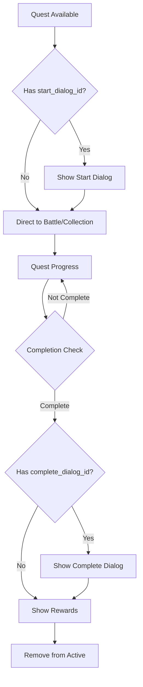

# Game Mechanics

> Được tách ra từ README.md chính để dễ quản lý và tra cứu

## 3. Công nghệ sử dụng

### Backend

- Python
- Flask (REST API) + Flask-Login (Authentication)
- MongoDB (NoSQL database): chỉ sử dụng cho dữ liệu **user**
  - **Development**: MongoDB Local (nhanh hơn, khuyến nghị)
  - **Production**: MongoDB Atlas (cloud)
- Session-based authentication với Flask-Login
- Các dữ liệu hệ thống khác như **quái vật (enemies), vật phẩm (items), nhiệm vụ (quests), hội thoại (dialogs), công trình (buildings), kỹ năng (skills)** sẽ được lưu trữ trong các file JSON tĩnh trên server, để giúp học viên dễ đọc, dễ chỉnh sửa, dễ hiểu.

#### Cấu trúc database `users`

```json
{
  "username": "cuongnv",
  "password": "123456",
  "created_at": "...",
  "gender": "male",
  "buildings": {
    "town_hall": 1,
    "storage": 1,       // Đã đổi từ "inventory"
    "blacksmith": 0,    // Đã đổi từ "forge"
    "market": 0,        // Đã đổi từ "shop"
    "mage_tower": 0
  },
  "quests": [
    { "quest_id": "q001", "state": "doing" },
    { "quest_id": "q004", "state": "done" }
  ],
  "dialogs_seen": [12],
  "inventory": [
    { "item_id": "sword001", "quantity": 1, "level": 2 },
    { "item_id": "hp_potion", "quantity": 5 }
  ],
  "equipment": {
    "helmet": { "item_id": "iron_helmet", "level": 1 },
    "armor": { "item_id": "leather_armor", "level": 0 },
    "weapon": { "item_id": "bronze_sword", "level": 2 },
    "ring": null
  },
  "gold": 1250,
  "exp": 780,
  "reputation": 35,
  "stats": {
    "STR": 12,
    "AGI": 8,
    "INT": 5,
    "VIT": 10,
    "WIS": 7,
    "crit_rate": 0.1
  },
  "skills": [
    { "skill_id": 1, "level": 2 },
    { "skill_id": 3, "level": 1 }
  ]
}
```

- `username`, `password`: thông tin đăng nhập
- `gender`: giới tính người chơi (`male` hoặc `female`) — được sử dụng để chọn hình ảnh nhân vật từ thư mục `static/img/player/`
- `buildings`: lưu cấp độ các công trình đã xây (0 nghĩa là chưa xây)
- `quests`: danh sách các nhiệm vụ người chơi đã nhận (và trạng thái)
- `dialogs_seen`: lưu lại những đoạn hội thoại đã xem
- `inventory`: chứa các item người chơi sở hữu
- `equipment`: 4 slot trang bị (helmet, armor, weapon, ring) với level upgrade
- `market`: item market được assign ngẫu nhiên khi đăng nhập
- `gold`: số tiền hiện có
- `exp`: kinh nghiệm hiện tại (level được tính từ EXP này)
- `reputation`: danh tiếng, ảnh hưởng đến tương tác NPC
- `stats`: chỉ số RPG cơ bản (không bao gồm bonus từ equipment)
- `skills`: kỹ năng đã học và cấp độ tương ứng

### Equipment System

Game có hệ thống trang bị với 4 slot chính:
- **Helmet (Mũ)**: Bảo vệ đầu, tăng VIT và các stat khác
- **Armor (Áo giáp)**: Bảo vệ cơ thể, chủ yếu tăng VIT
- **Weapon (Vũ khí)**: Công cụ tấn công, tăng STR và các stat tấn công
- **Ring (Nhẫn)**: Phụ kiện đa dạng, có thể tăng nhiều stat khác nhau

**Equipment Upgrade System:**
- Mỗi equipment có thể nâng cấp từ level 0 → 10
- Mỗi level tăng stats theo công thức: `base_stat * level_multiplier`
- Chi phí nâng cấp tăng exponentially theo level
- Cần materials và gold để nâng cấp

**Stat Calculation:**
```
Final_Stat = Base_Stat + Equipment_Bonus
Equipment_Bonus = Σ(Item_Base_Stat × Level_Multiplier)
```

### Frontend

- HTML, W3.CSS, CSS tùy chỉnh với background images
- Font Awesome 5.15.4
- JavaScript (dùng Fetch API để gọi API)
- **GML.js**: Thư viện sprite animation tự phát triển
- **Support.js**: Utilities và helper functions
- Responsive design với mobile support
- Visual effects và animations

---


## 6. Inventory System

### 6.1. Inventory Layout (70% - 30%)
Hệ thống inventory sử dụng layout chia đôi hiện đại:

```
┌─────────────────────────────────────────────────────────┐
│                    INVENTORY MODAL                      │
├─────────────────────┬───────────────────────────────────┤
│   GRID SLOTS (65%)  │      ITEM DETAIL (35%)           │
│                     │                                   │
│ [Tab Buttons]       │  ┌─────────────────────────────┐   │
│                     │  │       Item Image            │   │
│ ┌─┬─┬─┬─┬─┬─┐       │  │    (Animated Pulse)         │   │
│ │ │ │ │ │ │ │       │  └─────────────────────────────┘   │
│ ├─┼─┼─┼─┼─┼─┤       │                                   │
│ │ │ │ │ │ │ │       │  Item Name                       │
│ ├─┼─┼─┼─┼─┼─┤       │  Item Type (Việt hóa)            │
│ │ │ │ │ │ │ │       │  Price: 100 vàng                 │
│ ├─┼─┼─┼─┼─┼─┤       │  Level Requirement               │
│ │ │ │ │ │ │ │       │                                   │
│ ├─┼─┼─┼─┼─┼─┤       │  Description text...              │
│ │ │ │ │ │ │ │       │                                   │
│ └─┴─┴─┴─┴─┴─┘       │  ┌─────────────────────────────┐   │
│                     │  │        STATS                │   │
│                     │  │  STR: +10                   │   │
│                     │  │  AGI: +5                    │   │
│                     │  └─────────────────────────────┘   │
└─────────────────────┴───────────────────────────────────┘
```

### 6.2. Grid System (6x6 Slots)
```javascript
// 36 slots total (6 columns x 6 rows)
.inventory-grid {
    display: grid;
    grid-template-columns: repeat(6, 1fr);
    row-gap: 6px;
    column-gap: 6px;
}

// Slot states
.inventory-slot {
    aspect-ratio: 1;
    border: 2px solid var(--border-color);
}

.inventory-slot:hover {
    border-color: var(--primary-color);  // Blue hover
}

.inventory-slot.selected {
    border-color: #e74c3c;  // Red selection
}

.inventory-slot.empty {
    background: rgba(127, 140, 141, 0.1);  // Gray empty
}
```

### 6.3. Item Display & Icons
```javascript
// Item icons từ static/img/icon/item/{item_id}.png
function getItemIcon(itemData) {
    return `/static/img/icon/item/${itemData.item_id}.png`;
}

// Fallback system nếu image không load

<i class="item-icon fallback fas fa-cube" style="display: none;"></i>
```

### 6.4. Tooltip System
**Hover Tooltip**: Khi hover qua slot item
```javascript
// Show tooltip on hover
onmouseenter="showItemTooltip('${item.item_id}')"
onmouseleave="hideItemTooltip()"

// Click to select
onclick="selectItem('${item.item_id}')"
```

**Item Detail Panel**: Hiển thị chi tiết bên phải
- **Animated Image**: 90x90px với pulse animation  
- **Item Information**: Name, type (Việt hóa), price, description
- **Stats Display**: Equipment stats nếu có
- **Level Requirement**: Hiển thị yêu cầu level nếu có

### 6.5. Item Types & Behavior
```javascript
// Type mapping sang tiếng Việt
const typeMap = {
    'material': 'Nguyên liệu',
    'equipment': 'Trang bị',
    'consumable': 'Vật phẩm tiêu hao',
    'weapon': 'Vũ khí',
    'armor': 'Giáp',
    'accessory': 'Phụ kiện'
};

// Equipment actions
if (selectedItem && currentTab === 'equipment') {
    // Show "Sử dụng" button in modal footer
    useButton.style.display = 'inline-flex';
}
```

### 6.6. Inventory Data Structure
```javascript
// User inventory format
"inventory": [
    {
        "item_id": "bronze_sword",
        "quantity": 1,
        "level": 2  // Chỉ cho equipment
    },
    {
        "item_id": "wood", 
        "quantity": 50  // Materials có thể stack
    }
]

// Item data from items.json
{
    "item_id": "bronze_sword",
    "name": "Gươm đồng", 
    "type": "equipment",
    "price": 120,
    "description": "Một thanh gươm đơn giản làm từ đồng",
    "level_require": 1,
    "stat": {
        "STR": 3
    }
}
```

---


## 9. Quest & Dialog System (Enhanced)

### 9.1. Quest Management System

**🎯 Core Quest Features:**
- **Active Quest Limit**: Tối đa 5 quest active đồng thời
- **Auto Quest Assignment**: Tự động assign quest mới khi có slot trống
- **Level-based Filtering**: Quest chỉ xuất hiện khi đủ level requirement
- **State Management**: Available → Doing → Completed lifecycle

**📋 Quest Interface Design:**
- **Grid Layout**: Quest cards hiển thị dạng grid responsive
- **Quest Preview**: Name, description, level requirement, rewards
- **Action States**: 
  - "Bắt đầu" → Available quests
  - "Hoàn thành" → Quests với completed conditions
  - "Đang thực hiện" → Active quests in progress

**🔄 Quest Execution Flow:**


### 9.2. Dialog System Architecture

**💬 Advanced Dialog Features:**
- **Dynamic Backgrounds**: Priority system cho background selection
- **Progressive Blur**: Background blur effect với smooth transition
- **Sequential Messaging**: Messages hiển thị tuần tự với animations
- **Speaker Integration**: Avatar + localized names cho NPCs

**🎭 Dialog Interface Components:**

```html
<!-- Dialog Structure -->
<div class="dialog-container">
    <div class="dialog-background" style="background-image: url(...)"></div>
    <div class="dialog-wrapper">
        <div class="dialog-header">
            <h3>Quest Name</h3>
            <p class="dialog-type">Bắt đầu/Hoàn thành nhiệm vụ</p>
        </div>
        <div class="dialog-content">
            <div class="dialog-messages">
                <div class="dialog-message">
                    <div class="message-speaker">
                        
                        <span class="speaker-name">Speaker Name</span>
                    </div>
                    <div class="message-text">Dialog text...</div>
                </div>
            </div>
            <div class="dialog-controls">
                <button class="btn btn-primary">Tiếp tục</button>
            </div>
        </div>
    </div>
</div>
```

**🎨 Visual Enhancement System:**
```css
/* Background blur chỉ áp dụng cho background */
.dialog-background {
    filter: blur(2px);
    transition: filter 0.3s ease;
}

.dialog-background.focused {
    filter: blur(1px);
}

/* Message animation */
.dialog-message {
    opacity: 0;
    transform: translateY(20px);
    transition: all 0.3s ease;
}

.dialog-message.active {
    opacity: 1;
    transform: translateY(0);
}
```

### 9.3. Background Asset Management

**🖼️ Rich Background Collection:**
- **16 Different Backgrounds**: village, forest, cave, harbor, market, etc.
- **Context-Aware Mapping**: Background phù hợp với dialog content
- **Priority System**: `dialogData.background` → `quest.background` → fallback

**📂 Background Categories:**
```javascript
const backgroundCategories = {
    'Urban': ['village.jpg', 'market.jpg', 'room.jpg'],
    'Nature': ['forest.jpg', 'meadow.jpg', 'grassland.jpg'], 
    'Underground': ['cave.jpg', 'mine.jpg', 'lavacave.jpg'],
    'Coastal': ['harbor.jpg'],
    'Mysterious': ['ruins.png', 'desert.jpg'],
    'Specialized': ['snowfield.jpg', '1.jpg', '2.jpg', '3.jpg']
};
```

### 9.4. Speaker & Character System

**🎪 Comprehensive Speaker Database:**
```javascript
const speakerDatabase = {
    // NPCs
    'elder': { name: 'Trưởng làng', avatar: 'elder.png' },
    'merchant': { name: 'Thương gia', avatar: 'merchant.png' },
    'guard': { name: 'Lính canh', avatar: 'guard.png' },
    'john-fisher': { name: 'John - Ngư dân', avatar: 'john-fisher.png' },
    'marcus-scholar': { name: 'Marcus - Học giả', avatar: 'marcus-scholar.png' },
    'mina-inn-keeper': { name: 'Mina - Chủ quán trọ', avatar: 'mina-inn-keeper.png' },
    'jack-sailor': { name: 'Jack - Thủy thủ', avatar: 'jack-sailor.png' },
    'arch-mage': { name: 'Đại pháp sư', avatar: 'arch-mage.png' },
    'duke': { name: 'Công tước', avatar: 'duke.png' },
    'kyrina-pirate-leader': { name: 'Kyrina - Thủ lĩnh cướp biển', avatar: 'kyrina-pirate-leader.png' },
    'mira-dancer': { name: 'Mira - Vũ công', avatar: 'mira-dancer.png' },
    'amon-strange-merchant': { name: 'Amon - Thương gia bí ẩn', avatar: 'amon-strange-merchant.png' },
    
    // Player
    'player': { name: 'Người chơi', avatar: 'player.png' }
};
```

### 9.5. Quest-Dialog Integration

**🔗 Seamless Integration Features:**
- **Dialog Triggering**: Auto-trigger dialog dựa trên quest state
- **Context Passing**: Quest data được pass vào dialog system
- **State Synchronization**: Dialog completion updates quest state
- **Reward Processing**: Integrated reward system sau dialog completion

**⚡ Enhanced User Experience:**
- **Consistent Navigation**: Header + nav bar trong mọi trang
- **Smooth Transitions**: Animation giữa dialog messages
- **User Info Integration**: Real-time display user stats
- **Error Handling**: Graceful fallbacks cho missing data

---


## 10. Các Route

### A. Trang chính (`/`)

- **Logic redirect thông minh:**
  - Chưa đăng nhập: Hiển thị form login/register
  - Đã đăng nhập: Tự động redirect đến `/town`
- **Slideshow**: Giới thiệu game với hình ảnh động
- **Responsive layout**: 2 cột (slideshow + auth forms)

### B. Xây dựng thị trấn (`/town`) - Protected Route

| Công trình                   | Tính năng                                        | Cải tiến nâng cấp                                     |
|-----------------------------|--------------------------------------------------|-------------------------------------------------------|
| Thợ rèn (blacksmith)        | Chế tạo và nâng cấp trang bị                     | Tăng giới hạn upgrade level                           |
| Chợ (market)                | Mua bán vật phẩm                                 | Tăng số lượng item xuất hiện trong shop               |
| Tòa thị chính (town_hall)   | Nhận nhiệm vụ phụ tuyến                          | Tăng độ khó nhiệm vụ                                  |
| Kho (storage)               | Quản lý item người chơi                          | Tăng số lượng slot lưu trữ                            |
| Tháp phép thuật (mage_tower)| Học và nâng cấp kỹ năng phép thuật               | Mở bán sách phép, xem và nâng cấp kỹ năng đã học     |

#### Giao diện `/town`

- Các công trình được render dạng card theo grid 3 cột
- Hover để xem tên, click mở modal tương ứng
- Tòa thị chính mở `/quests`
- Có nút “Xây dựng” để hiện danh sách công trình có thể xây

---

### B. Chiến đấu theo lượt (`/battle`)

- Dạng 1 vs 1, luân phiên
- Kẻ địch xác định qua `battle_enemy` (từ localStorage)
- Gọi API lấy dữ liệu enemy từ JSON

---

### D. Nhiệm vụ (`/quests`) - Protected Route

- Tối đa 5 nhiệm vụ đang hoạt động
- Trạng thái: chưa nhận, đang thực hiện, đã hoàn thành
- Khi thiếu nhiệm vụ, hệ thống tự thêm mới từ file JSON
- Nút “Bắt đầu” sẽ chuyển sang minigame hoặc battle

---

### E. Hội thoại (`/dialog/<id>/<quest_id>`) - Protected Route

- Hiện đoạn thoại tương tác (từng dòng)
- Có 2 loại:
  - Dẫn nhập nhiệm vụ
  - Kết thúc nhiệm vụ, nhận thưởng
- Nội dung lấy từ file `dialogs.json` dựa theo `dialog_id`
- Mỗi dòng có nút **"Tiếp tục"** để chuyển sang dòng kế
- Sau khi kết thúc hội thoại sẽ ảnh hưởng đến nhiệm vụ với `quest_id` tương ứng:
  - Nếu là hội thoại bắt đầu nhiệm vụ → đánh dấu nhiệm vụ là `doing`
  - Nếu là hội thoại kết thúc nhiệm vụ → mở modal phần thưởng, xoá nhiệm vụ khỏi database của user, sau đó redirect về `/town`


---


## 10. Gameplay chính

### 10.1. Cấu trúc file `enemies.json`

(Thư mục ảnh: `static/img/enemies/{enemy_id}_attack_{frame}.png`)

```json
{
  "id": 1023,
  "name": "Troll Rừng",
  "stats": {
    "STR": 15,
    "AGI": 6,
    "INT": 3,
    "VIT": 12,
    "WIS": 5,
    "crit_rate": 0.05
  },
  "skills": [
    { "skill_id": 1001, "priority": 0.7 },
    { "skill_id": 1004, "priority": 0.3 }
  ],
  "drop": [
    { "item_id": 1005, "rate": 0.5 },
    { "item_id": 1006, "rate": 0.2 }
  ],
  "exp_reward": 120
}
```

### Ghi chú:

- `id`: định danh duy nhất của quái, cũng dùng để lấy ảnh hoạt ảnh (`{id}_attack_{frame}.png`)
- `name`: tên hiển thị
- `stats`: chỉ số cơ bản (HP và MP sẽ được tính từ VIT và WIS)
- `skills`: danh sách kỹ năng mà quái sử dụng, kèm `priority` (tỉ lệ ưu tiên dùng skill, tổng cộng không nhất thiết là 1.0)
- `drop`: danh sách item có thể rơi, với `item_id` và `rate` (0.0 → 1.0)
- `exp_reward`: số EXP người chơi nhận được nếu tiêu diệt

---

### 10.2. Cấu trúc file `skills.json`

(Thư mục ảnh: `static/img/icon/skill/{skill_id}.png`)

```json
{
  "skill_id": 1001,
  "name": "Tấn công thường",
  "damage_type": "physical",
  "effect_id": 1
}
```

### Ghi chú:

- `skill_id`: bắt đầu từ 1001, quy ước 1001 là đòn đánh thường
- `name`: tên hiển thị
- `damage_type`: kiểu sát thương (`physical` hoặc `magical`) để quyết định công thức tính damage
- `effect_id`: id của hiệu ứng hiển thị trong trận chiến (ví dụ: hiệu ứng chém, bắn lửa...)
- Không có hình ảnh riêng — icon kỹ năng mặc định là `{skill_id}.png` trong thư mục `skill/`
- Công thức tính damage sẽ được viết riêng trên server tùy theo từng skill

---

### 10.3. Cấu trúc file `items.json`

(Thư mục ảnh: `static/img/icon/item/{item_id}.png`)

```json
{
  "item_id": 1001,
  "name": "Gươm đồng",
  "type": "equipment",
  "price": 120,
  "description": "Một thanh gươm đơn giản làm từ đồng",
  "stat": {
    "STR": 3
  },
  "upgrade_material": [1026, 1030, 1041]
}
```

### Ghi chú:

- `item_id`: số nguyên, bắt đầu từ 1001
- `name`: tên item
- `type`: `equipment` hoặc `material`
- `price`: giá **bán ra**; giá mua được tính là `price + 15%`
- `description`: chú thích ngắn gọn
- `stat`: chỉ có ở item dạng `equipment`, là chỉ số cộng thêm
- `upgrade_material`: danh sách `item_id` dùng để nâng cấp (áp dụng cho equipment)

### Hệ thống inventory:

- Chia làm 2 tab: `equipment` và `material`
- Equipment:
  - Không stack
  - Có chỉ số, có thể nâng cấp
- Material:
  - Stack không giới hạn
  - Dùng để xây dựng, nâng cấp, hoặc làm nhiệm vụ
- Game **không có** item hồi phục hay tiêu dùng → hồi phục sẽ được đảm nhiệm bởi **kỹ năng phép thuật**

---

### 10.4. Cấu trúc file `buildings.json`

(Thư mục ảnh: `static/img/icon/building/{building_id}.png` hoặc `static/img/building/{building_id}.png`)

```json
{
  "building_id": 1001,
  "name": "Tòa thị chính",
  "description": "Nơi nhận nhiệm vụ và điều hành thị trấn.",
  "upgrade_material": {
    "1": {
      "gold": 100,
      "materials": [
        { "item_id": 2001, "quantity": 3 },
        { "item_id": 2002, "quantity": 1 }
      ]
    },
    "2": {
      "gold": 250,
      "materials": [
        { "item_id": 2001, "quantity": 5 },
        { "item_id": 2003, "quantity": 2 }
      ]
    }
  }
}
```

### Ghi chú:

- `building_id`: bắt đầu từ 1001, cũng là tên ảnh đại diện
- `name`: tên công trình
- `description`: mô tả công dụng của công trình
- `upgrade_material`: các nguyên liệu và số vàng cần để xây/lên cấp
  - Key `"1"`, `"2"` là cấp độ (string hoặc số nguyên)
  - `gold`: số vàng cần để nâng cấp
  - `materials`: danh sách nguyên liệu yêu cầu (item_id và quantity)
- **Không có thời gian xây dựng** để đơn giản hóa gameplay


---

### 10.5. Cấu trúc file `quests.json`

(Trang hiển thị: `/quests` – danh sách các nhiệm vụ đang hoạt động hoặc có thể nhận)

```json
{
  "quest_id": "q001",
  "name": "Giải cứu dân làng",
  "description": "Một nhóm quái vật đang đe dọa ngôi làng gần thị trấn. Hãy đánh bại chúng!",
  "background": "forest.jpg",
  "enemy_id": 1023,
  "start_dialog_id": 12,
  "complete_dialog_id": -1,
  "required_items": [],
  "reward": {
    "gold": 300,
    "exp": 150,
    "items": [
        {"item_id": 1031, "quantity": 1 },
        {"item_id": 1025, "quantity": 2 }
    ]
  },
  "level_required": 1
}
```

### Ghi chú:

- `quest_id`: chuỗi định danh nhiệm vụ (dạng `"q001"`)
- `name`: tên nhiệm vụ
- `description`: nội dung mô tả nhiệm vụ, hiển thị ở `/quests`
- `background`: tên file ảnh nền cho trận chiến hoặc dialog (trong `static/img/background/`)
- `enemy_id`: id kẻ địch cần tiêu diệt nếu là nhiệm vụ dạng chiến đấu
- `start_dialog_id`: id hội thoại khởi đầu nhiệm vụ. Nếu là -1 thì không có hội thoại dẫn truyện
- `complete_dialog_id`: id hội thoại khi hoàn thành nhiệm vụ. Nếu là -1 thì không có hội thoại kết thúc
- `required_items`: (tuỳ chọn) danh sách item cần giao nộp để hoàn thành nhiệm vụ
- `reward`: phần thưởng khi hoàn thành nhiệm vụ (gold, exp, items)
- `level_required`: cấp độ tối thiểu để hiển thị nhiệm vụ

### Quest System Features:

**🎯 Quest Assignment Logic:**
- **Auto-generation**: Tự động thêm quest mới khi user có slot trống (tối đa 5)
- **Level filtering**: Chỉ assign quest phù hợp với level của player
- **Random selection**: Chọn ngẫu nhiên từ pool quest available
- **State management**: Track quest states (available → doing → completed)

**🔄 Quest Execution Flow:**
1. **Start Quest**: Click "Bắt đầu" → Check `start_dialog_id`
   - Có dialog → Redirect `/dialog/{start_dialog_id}/{quest_id}`
   - Không dialog → Direct to battle/collection
2. **Quest Progress**: Battle enemies hoặc collect required items
3. **Complete Quest**: Check completion conditions → Show `complete_dialog_id`
4. **Rewards**: Process rewards → Update user stats → Remove from active quests

**⚡ Enhanced Quest Types:**
- **Combat Quest**: Có `enemy_id` → Battle system
- **Collection Quest**: Có `required_items` → Item gathering
- **Story Quest**: Có dialog IDs → Rich narrative experience
- **Hybrid Quest**: Kết hợp combat + collection + story

---
### 10.6. Cấu trúc file `dialogs.json`

(Trang hiển thị: `/dialog/<dialog_id>/<quest_id>` — hiện đoạn hội thoại tương tác)

```json
{
  "dialog_id": 12,
  "type": "start",
  "background": "village.jpg",
  "lines": [
    { "speaker": "elder", "text": "Có phải bạn là một hiệp sĩ?" },
    { "speaker": "elder", "text": "Hiệp sĩ mau giúp đỡ chúng tôi!" },
    { "speaker": "player", "text": "Tôi sẽ giúp ngôi làng này. Nhưng có chuyện gì vậy" },
    { "speaker": "elder", "text": "Có quái vật xuất hiện ở làng phía đông!" },
    { "speaker": "player", "text": "Tôi sẽ đến đó ngay lập tức!" }
  ]
}
```

### Ghi chú:

- `dialog_id`: số nguyên định danh đoạn hội thoại, liên kết với nhiệm vụ
- `type`: `"start"` hoặc `"end"` — phân biệt hội thoại mở đầu hay kết thúc nhiệm vụ
- `background`: tên file ảnh nền hiển thị trong hội thoại (từ `static/img/background/`)
- `lines`: mảng các dòng hội thoại với speaker và text

### Dialog System Features:

**🎭 Advanced Dialog Interface:**
- **Dynamic Background**: Ưu tiên `dialogData.background` → `quest.background` → fallback
- **Background Blur**: Blur effect chỉ áp dụng cho background, không ảnh hưởng UI
- **Sequential Display**: Messages hiển thị tuần tự với smooth animations
- **Speaker Integration**: Avatar + localized name cho mỗi speaker

**🎨 Visual & Animation System:**
```javascript
// Background selection priority
let backgroundUrl = '/static/img/background/village.jpg'; // Default
if (dialogData.background) {
    backgroundUrl = `/static/img/background/${dialogData.background}`;
} else if (quest.background) {
    backgroundUrl = `/static/img/background/${quest.background}`;
}
```

**🔄 Dialog Execution Flow:**
1. **Load Dialog**: API call `/api/dialog/{dialog_id}` với quest context
2. **Initialize UI**: Set background với blur, create dialog structure
3. **Message Display**: Show messages tuần tự với "Tiếp tục" button
4. **Quest Integration**: 
   - `type: "start"` → Mark quest as "doing" → Redirect `/quests`
   - `type: "end"` → Complete quest → Show rewards → Redirect `/town`
5. **Animation Control**: Start/stop blur effects based on dialog state

**🎪 Enhanced Speaker System:**
- **Localized Names**: Việt hóa speaker names (elder → Trưởng làng)
- **Avatar System**: Dynamic loading từ `/static/img/avatar/{speaker}.png`
- **Fallback Support**: Default avatar nếu speaker image không tồn tại
- **Speaker Types**: Support cho NPCs, player, và custom characters

**📚 Background Asset Integration:**
- **Rich Backgrounds**: 16 different backgrounds (village, forest, cave, harbor, ruins, etc.)
- **Context Matching**: Background phù hợp với scene content
- **Example Mappings**:
  - Village dialogs → `village.jpg`
  - Merchant dialogs → `market.jpg`
  - Fisher quests → `harbor.jpg`
  - Cave exploration → `cave.jpg`, `mine.jpg`, `lavacave.jpg`
  - Mysterious encounters → `ruins.png`

**🔧 Technical Implementation:**
- **Progressive Enhancement**: Blur effect tăng dần sau khi load
- **Memory Optimization**: Animation chỉ chạy khi dialog active
- **Error Handling**: Graceful fallbacks cho missing assets
- **Navigation Integration**: Consistent với main app navigation
---

---


## 11. Cấu trúc thư mục dự án

```
herofate/
├── 📄 Core Application
│   ├── app.py                    # Main Flask application với Flask-Login
│   ├── database.py               # Database abstraction layer  
│   ├── models.py                 # User model cho Flask-Login
│   └── .env                      # Environment configuration
│
├── 📊 Data & Assets
│   ├── data/                     # JSON data files (Game content)
│   │   ├── enemies.json          # Enemy definitions & stats
│   │   ├── skills.json           # Skill database & effects
│   │   ├── items.json            # Equipment & materials
│   │   ├── buildings.json        # Building upgrade requirements
│   │   ├── quests.json           # Quest definitions & rewards
│   │   └── dialogs.json          # Dialog scripts & backgrounds
│   │
│   ├── static/                   # Frontend assets & media resources
│   │   ├── css/
│   │   │   ├── variables.css     # CSS variables cho theming
│   │   │   └── style.css         # Main CSS với animations & responsive
│   │   │
│   │   ├── js/
│   │   │   ├── gml.js            # Sprite animation library (tự phát triển)
│   │   │   ├── support.js        # Utility functions & API wrapper
│   │   │   └── main.js           # Core JavaScript với Fetch API
│   │   │
│   │   └── img/                  # 🎨 Rich Media Assets Collection
│   │       │
│   │       ├── background/       # 🖼️ Background Images (16 files)
│   │       │   ├── village.jpg   # Village & urban scenes
│   │       │   ├── forest.jpg    # Nature environments
│   │       │   ├── cave.jpg      # Underground locations
│   │       │   ├── harbor.jpg    # Coastal & maritime
│   │       │   ├── market.jpg    # Commercial areas
│   │       │   ├── room.jpg      # Indoor scenes
│   │       │   ├── mine.jpg      # Mining locations
│   │       │   ├── lavacave.jpg  # Volcanic environments
│   │       │   ├── ruins.png     # Ancient ruins
│   │       │   ├── desert.jpg    # Desert landscapes
│   │       │   ├── meadow.jpg    # Peaceful meadows
│   │       │   ├── grassland.jpg # Open grasslands
│   │       │   ├── snowfield.jpg # Winter environments
│   │       │   ├── 1.jpg         # Generic background 1
│   │       │   ├── 2.jpg         # Generic background 2
│   │       │   └── 3.jpg         # Generic background 3
│   │       │
│   │       ├── building/         # 🏗️ Building Assets
│   │       │   ├── ground.png    # Ground texture base
│   │       │   ├── town_hall.png # Tòa thị chính
│   │       │   ├── storage.png   # Kho lưu trữ
│   │       │   ├── blacksmith.png# Thợ rèn
│   │       │   ├── market.png    # Chợ
│   │       │   └── mage_tower.png# Tháp phép thuật
│   │       │
│   │       ├── icon/             # 🎯 UI Icon Collections
│   │       │   ├── building/     # Building icons cho UI
│   │       │   ├── button/       # Action button icons
│   │       │   │   ├── quest.png # Quest icon
│   │       │   │   ├── logout.png# Logout icon
│   │       │   │   └── battle.png# Battle icon
│   │       │   ├── info/         # User stat icons
│   │       │   │   ├── gold.png  # Gold currency
│   │       │   │   ├── exp.png   # Experience points
│   │       │   │   └── reputation.png # Reputation
│   │       │   ├── item/         # Item icons (.png format)
│   │       │   │   ├── bronze_sword.png
│   │       │   │   ├── wood.png
│   │       │   │   └── ...       # Extensive item collection
│   │       │   └── skill/        # Skill icons
│   │       │       ├── 1001.png  # Basic attack
│   │       │       └── ...       # Magic & combat skills
│   │       │
│   │       ├── enemies/          # 👹 Enemy Sprites
│   │       │   ├── {enemy_id}_attack_1.png
│   │       │   ├── {enemy_id}_attack_2.png
│   │       │   ├── {enemy_id}_attack_3.png
│   │       │   └── {enemy_id}_attack_4.png
│   │       │   # Multi-frame attack animations
│   │       │
│   │       ├── player/           # 🧙‍♂️ Player Character Assets
│   │       │   ├── male_idle.png # Male character sprite sheet
│   │       │   ├── female_idle.png # Female character sprite sheet
│   │       │   └── avatars/      # Character portraits
│   │       │
│   │       ├── avatar/           # 👥 NPC & Speaker Portraits
│   │       │   ├── elder.png     # Trưởng làng
│   │       │   ├── merchant.png  # Thương gia
│   │       │   ├── guard.png     # Lính canh
│   │       │   ├── john-fisher.png # John - Ngư dân
│   │       │   ├── marcus-scholar.png # Marcus - Học giả
│   │       │   ├── mina-inn-keeper.png # Mina - Chủ quán trọ
│   │       │   ├── jack-sailor.png # Jack - Thủy thủ
│   │       │   ├── arch-mage.png # Đại pháp sư
│   │       │   ├── duke.png      # Công tước
│   │       │   ├── kyrina-pirate-leader.png # Kyrina - Thủ lĩnh cướp biển
│   │       │   ├── mira-dancer.png # Mira - Vũ công
│   │       │   ├── amon-strange-merchant.png # Amon - Thương gia bí ẩn
│   │       │   ├── player.png    # Player avatar
│   │       │   └── default.png   # Fallback avatar
│   │       │
│   │       └── npc/              # 📖 Legacy NPC Portraits
│   │           └── ...           # Additional character images
│   │
│   └── templates/                # 🌐 Jinja2 HTML Templates
│       ├── index.html            # Landing page với auth system
│       ├── town.html             # Main game interface
│       ├── battle.html           # Combat interface
│       ├── quests.html           # Quest management system
│       └── dialog.html           # Dialog system với animations
│
├── 🔧 Scripts & Utils
│   ├── start.bat                 # Main startup script
│   ├── start_local.bat           # Local development với MongoDB local
│   ├── switch_db.bat             # Environment switching utility
│   ├── migrate_buildings.py      # Database migration tool
│   └── requirements.txt          # Python dependencies
│
├── 📖 Documentation & Config
│   ├── README.md                 # Comprehensive project documentation
│   ├── .gitignore               # Git ignore rules
│   └── CLEANUP_SUMMARY.md       # Project cleanup log
│
└── 🗃️ Development
    ├── git-push.bat             # Git automation scripts
    ├── git-start.bat            # Git repository initialization
    └── __pycache__/             # Python cache directory
```

### 📂 **Static Assets Breakdown & Usage**

#### 🎨 **Background Images (16 files)**
Hệ thống background đa dạng cho dialog và battle scenes:

**Urban Environments:**
- `village.jpg` - Làng quê, NPC conversations
- `market.jpg` - Khu chợ, merchant interactions
- `room.jpg` - Phòng kín, private meetings

**Nature Environments:**
- `forest.jpg` - Rừng cây, adventure quests
- `meadow.jpg` - Đồng cỏ, peaceful scenes
- `grassland.jpg` - Thảo nguyên rộng lớn

**Underground/Cave Systems:**
- `cave.jpg` - Hang động thông thường
- `mine.jpg` - Hầm mỏ, resource gathering
- `lavacave.jpg` - Hang động nham thạch, boss battles

**Specialized Locations:**
- `harbor.jpg` - Bến cảng, sailor/fishing quests
- `ruins.png` - Tàn tích cổ đại, mysterious encounters
- `desert.jpg` - Sa mạc, extreme environments
- `snowfield.jpg` - Vùng tuyết, winter quests

#### 🎯 **Icon System Architecture**
Hệ thống icon được tổ chức theo chức năng:

**UI Navigation Icons (`icon/button/`):**
- Quest, battle, logout buttons
- Consistent design language
- 24x24px standard size

**User Stats Icons (`icon/info/`):**
- Gold, EXP, reputation indicators
- 16x16px for compact display
- Visual feedback system

**Game Content Icons:**
- **Items** (`icon/item/`): .png format, optimized loading
- **Skills** (`icon/skill/`): .png format, clear visualization
- **Buildings** (`icon/building/`): Consistent với building sprites

#### 👥 **Character & Avatar System**
Comprehensive character representation:

**Player Characters (`player/`):**
- Gender-based sprite sheets (male/female)
- 4-frame idle animations (128x128px)
- GML.js animation integration

**NPC Avatars (`avatar/`):**
- 13 unique NPCs với localized names
- Consistent art style
- Dialog system integration
- Fallback support cho missing characters

#### 🏗️ **Building Visual Assets**
Complete building ecosystem:
- Individual building sprites
- Ground texture base
- Scale 2x cho visual emphasis
- Level badges (xanh/đỏ states)

### 🔄 **Asset Loading Strategy**

**Performance Optimizations:**
- **Lazy Loading**: Chỉ load assets khi cần
- **Format Optimization**: .png cho items và UI (unified format)
- **Fallback System**: Graceful degradation
- **Caching Strategy**: Browser cache optimization

**Error Handling:**
```javascript
// Fallback system example

```

**Memory Management:**
- Conditional asset loading
- Animation frame optimization
- Background image preloading

---

---


